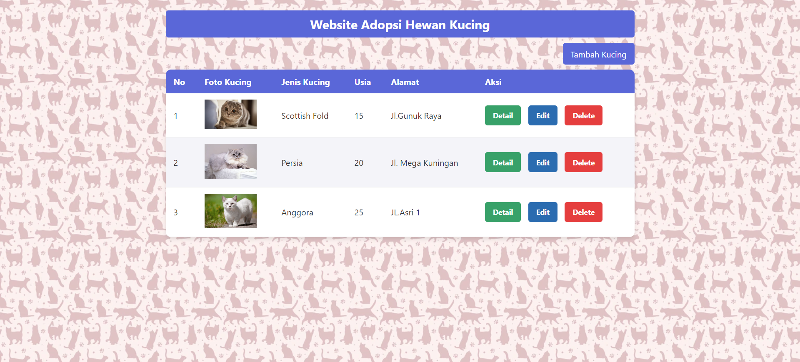
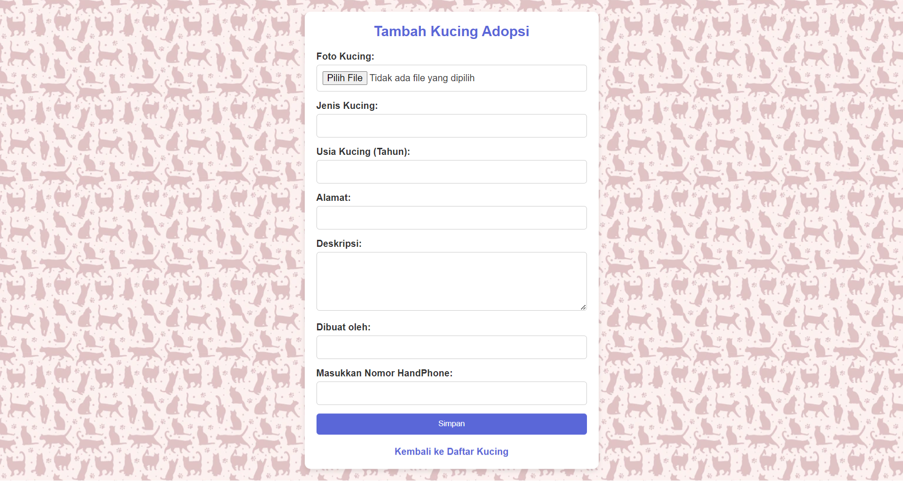
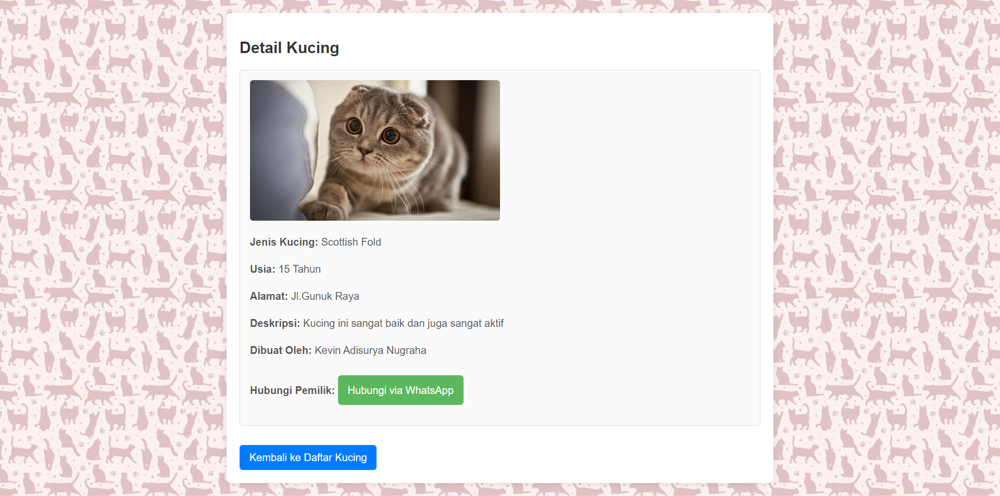
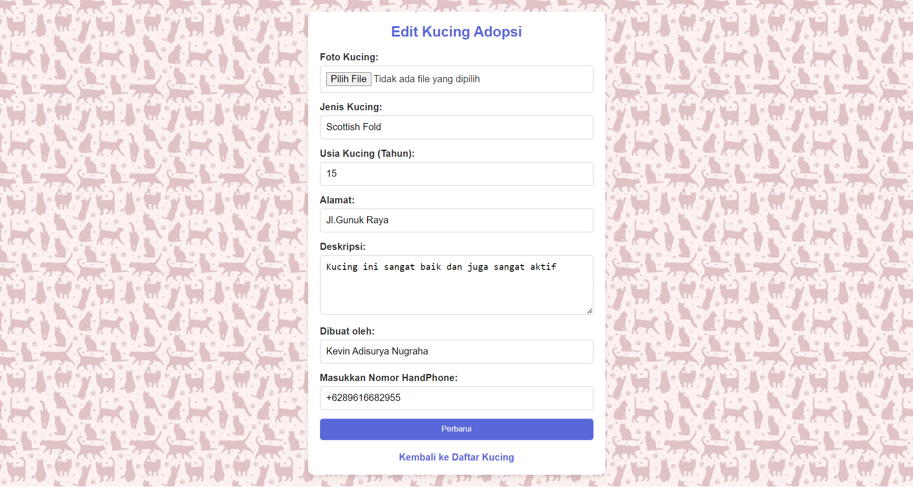

# 🐾 Aplikasi Adopsi Kucing 😺

Selamat datang di **Aplikasi Adopsi Kucing**! 🎉  
Aplikasi ini dirancang untuk memudahkan Anda dalam melihat dan mengadopsi kucing-kucing lucu. Selain itu, Anda juga bisa menawarkan kucing Anda agar diadopsi oleh orang lain. 🐱💖

## 🚀 Fitur Utama

- **Daftar Kucing**: Tampilkan kucing-kucing yang siap diadopsi lengkap dengan foto, usia, ras, dan deskripsi singkat.
- **Tambah Kucing**: Fitur untuk menambahkan kucing yang ingin diadopsikan lengkap dengan informasi detail.
- **Detail Kucing**: Lihat informasi detail dari setiap kucing dan langsung hubungi pemilik melalui WhatsApp.
- **Edit dan Hapus Kucing**: Pemilik kucing dapat mengedit atau menghapus kucing yang sudah didaftarkan untuk adopsi.

## 📚 Teknologi yang Digunakan

Proyek ini dibangun menggunakan teknologi-teknologi berikut:

- **HTML5**: Untuk struktur halaman aplikasi.
- **CSS3**: Untuk membuat desain antarmuka yang cantik dan responsif.
- **PHP**: Backend yang mengelola proses seperti menambah, mengedit, dan menghapus kucing.
- **SQLite**: Sebagai database untuk menyimpan semua informasi kucing yang ingin diadopsi.

## 💻 Dokumentasi

### Halaman Utama
Pada halaman utama, pengguna dapat melihat semua kucing yang terdaftar untuk diadopsi. Setiap kucing menampilkan informasi seperti nama, usia, ras, dan alamat pemilik.

--------------------------------------------------------

### Halaman Tambah Kucing
Halaman ini memungkinkan pengguna untuk menambahkan kucing baru ke daftar adopsi dengan memasukkan informasi lengkap seperti nama, usia, ras, foto, dan deskripsi kucing.

--------------------------------------------------------

### Halaman Detail Kucing
Pengguna bisa melihat detail lengkap kucing dan menghubungi pemilik langsung melalui WhatsApp jika tertarik untuk mengadopsi.

--------------------------------------------------------

### Halaman Edit Kucing
Pemilik dapat mengedit informasi kucing yang telah mereka tambahkan melalui halaman ini.

--------------------------------------------------------

## 📝 Cara Menggunakan Aplikasi

1. **Melihat Kucing**: Lihat daftar kucing yang ingin diadopsi pada halaman utama.
2. **Menambah Kucing**: Jika ingin menambahkan kucing untuk diadopsikan, gunakan halaman **Tambah Kucing**.
3. **Menghubungi Pemilik**: Pada halaman detail kucing, klik "Hubungi Pengadopsi" untuk langsung menghubungi pemilik via WhatsApp.
4. **Mengedit atau Menghapus Kucing**: Pemilik bisa mengedit atau menghapus kucing yang mereka tambahkan dari daftar.

--------------------------------------------------------

# 🙏🏻 Terima Kasih 🙏🏻

Terima kasih telah menggunakan **Aplikasi Adopsi Kucing**! Jangan lupa untuk share aplikasi ini dan dukung adopsi hewan. 🐾
